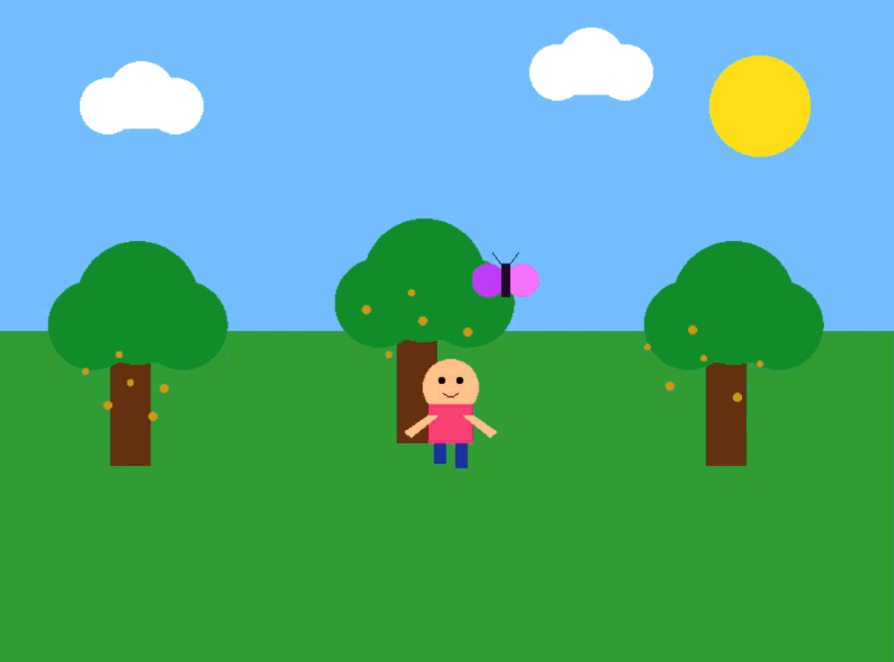

# A Little Journey To The Enchanted Forest - An iteractive 2D Animated Story

# Project Purpose & Overview
The project is an interactive 2D narrative mini-game built using C++ and OpenGL (FreeGLUT). It takes the player through an animated, story-driven adventure featuring a character named Mimi as she explores a magical forest, interacts with wildlife, crosses a river, catches a falling star, and returns home.

**STORY OVERVIEW:**
 Mimi lives near a beautiful forest. One day, she meets a playful magical butterfly and plays with it. Along the way, a friendly rabbit helps her to cross the river. As night falls, a glowing star magically falls from the sky. Mimi catches it, and suddenly the entire forest lights up with beautiful magic. With a heart full of wonder, Mimi returns home, carrying the memory of her little magical adventure.

# Project at a Glance

|Item | Details |
| :--- | :--- |
| **Project Type** | 2D Graphical Adventure |
| **Language** | C++ |
| **Graphics Library** | OpenGL with FreeGLUT |
| **Group Member** |• Sania Hossain Sigma (ID: 233031212) • Hridita Chandra Deb (ID: 233030612) • Sumaiya Akter (ID: 233027512)  |
| **Department & University** | COMPUTER SCIENCE AND ENGINEERING, EAST DELTA UNIVERSITY |

  

#  Controls & Navigation:
* PRESS 's' — Start the scene to begin the journey.
* PRESS 'SPACEBAR' — Trigger scene interactions and progress through story scenes.
* PRESS 'LEFT ARROW'/ 'RIGHT ARROW` — Move Mimi horizontally.
* PRESS 'd' — Make Mimi enter her house in the final scene.
* PRESS 'r' — Reset the game back to the title screen at any time.

# Setup Dependencies and how to build and run:
  
* Step 1: Download & Extract **FreeGLUT**. Extract 'freeglut-mingw-master.zip' file .Select bin, include and lib based on your system (32-bit / 64-bit):
1. Bin Files: Copy 'freeglut.dll`. Paste it into C:\Windows.
2. Include Files: Copy the inside GL folder (containing all  files) and paste  into: C:\Program Files\CodeBlocks\MinGW\x86_64-w64-mingw32\include.
3. Lib Files: Copy .a files and then paste them into: C:\Program Files\CodeBlocks\MinGW\x86_64-w64-mingw32\lib.
4. Install **Notepad++** if not already installed.
   * C:\Program Files\CodeBlocks\share. then select 'glut.cbp' in notepad++. then goto to search then replace:
   * Find what: 'glut32'
   * Replace with: 'freeglut'.
   * Click **Replace All** and save the file.
5.  C:\Program Files\CodeBlocks\wizard. then select 'glut'. then do as step 4 process.

* Step 2: **Code::Blocks** Toolchain Executable Path
1. Open **Code::Blocks**.Go to Settings then Compiler then select the **Toolchain executables** tab.
2. Set the Compiler's Installation Directory to: C:\Program Files\CodeBlocks\MinGW
5. Click OK

* Step 3: Build and Run
1. Download "ENCHANTED_FOREST.cbp".
2. Open the project in Code::Blocks.
3. Select Build and Run.

# CONCLUSION:
A Little Journey to the Enchanted Forest** successfully demonstrates the integration of core 2D computer graphics principles, mathematical trajectory calculations, and interactive state management using C++ and OpenGL (FreeGLUT). By building the entire environment procedurally—without relying on pre-rendered image textures—the project highlights how basic visual building blocks like geometric primitives, smooth color interpolation, trigonometric curves, and timing loops can be combined to create a compelling, animated narrative experience.

     
